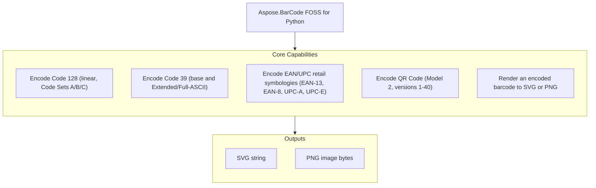

# Aspose.BarCode FOSS for Python

[](LICENSE) [](https://github.com/aspose-barcode-foss/Aspose.BarCode-FOSS-for-Python/graphs/contributors)

[](https://products.aspose.org/barcode/python/)

Aspose.BarCode FOSS for Python is a free, open-source, MIT-licensed, pure-Python library for
generating deterministic, standards-compliant barcodes. It encodes linear and 2D symbologies —
Code 128, Code 39 (base and Extended), EAN-13, EAN-8, UPC-A, UPC-E, and QR Code — through the
`Barcode` object returned by dedicated helper functions or the generic `generate()` entry point,
and renders the result as SVG or PNG, with no system-level dependencies beyond Pillow for PNG
output.

## Navigation

- [At a Glance](#at-a-glance)
- [Key Capabilities](#key-capabilities)
- [Installation](#installation)
- [Dependencies](#dependencies)
- [Quick Start](#quick-start)
- [Additional Examples](#additional-examples)
- [API Reference](#api-reference)
- [Documentation & Resources](#documentation--resources)
- [Scope and Limitations](#scope-and-limitations)
- [Development and Testing](#development-and-testing)
- [License](#license)

## At a Glance



## Key Capabilities

- Code 128 barcodes encode with automatic optimal Code Set A/B/C switching, or a specific code
  set forced through `Code128Options.encode_mode`.
- Encode Code 39 barcodes in the base 43-character set or the Extended/Full-ASCII form (via
  `code39()`/`code39ext()`), with an optional modulo-43 check character.
- EAN-13, EAN-8, UPC-A, and UPC-E retail barcodes support automatic check-digit computation or
  explicit check-digit validation via `allow_check_digit_input`.
- QR Code (Model 2) generation spans versions 1-40, with selectable error correction level
  (`QrErrorCorrectionLevel`) and encoding mode (`QrEncodeMode`).
- Select any symbology by name — canonical or alias — through the generic `generate()`
  (`generate(symbology, data)`) entry point, independent of the dedicated per-symbology helpers.
- Render any encoded barcode to SVG (`to_svg()`) or PNG (`to_png()`), or through a custom
  `Renderer` subclass passed to `Barcode.render()`.
- Control rendering with `RenderOptions` — scale, DPI, module width/height, quiet zone,
  foreground/background color, transparent background, and text display/font.

## Installation

The package is not yet published to PyPI. Install it from a source checkout:

```bash
git clone https://github.com/aspose-barcode-foss/Aspose.BarCode-FOSS-for-Python.git
cd Aspose.BarCode-FOSS-for-Python
pip install .
```

The distribution is named `aspose-barcode-foss`; the import package is `aspose_barcode_foss`.
Requires Python 3.12+ and Pillow >= 10.1.0 (a real, declared runtime dependency, used only for
PNG rendering) — otherwise the library has no system-level dependencies, and ships a `py.typed`
marker for full type-checker support.

## Dependencies

### Required Package Dependencies

- `Pillow` >=10.1.0 — used only for PNG rendering; SVG output has no third-party dependency.

### Native and System Requirements

- Python 3.12 or later.

### Development Dependencies

- `pytest` >=8.0 and `ruff` >=0.15.7 — used only by the test suite and linter, never required to
  install or use the library.

## Quick Start

Generate a Code 128 barcode and render it to SVG and PNG:

```python
from aspose_barcode_foss import code128

barcode = code128("Hello-World")
svg = barcode.to_svg()   # -> str
png = barcode.to_png()   # -> bytes
```

## Additional Examples

Runnable scripts are available in the [`examples`](examples/) directory
(`all_symbologies.py`, `render_options.py`, `error_handling.py`, `quickstart.py`). Additional
worked examples cover the generic entry point and per-symbology encoding options below.

Select a symbology by name through `generate()`:

```python
from aspose_barcode_foss import generate

barcode = generate("qr", "https://example.com")
png = barcode.to_png()
```

<details><summary>View Additional Examples</summary>

Configure QR Code encoding options:

```python
from aspose_barcode_foss import qr, QrOptions, QrErrorCorrectionLevel, QrEncodeMode

barcode = qr(
    "PAYLOAD",
    encode=QrOptions(
        error_correction_level=QrErrorCorrectionLevel.H,
        encoding_mode=QrEncodeMode.AUTO,
    ),
)
```

Add a modulo-43 check character to a Code 39 barcode:

```python
from aspose_barcode_foss import code39, Code39Options

barcode = code39("ABC-123", encode=Code39Options(add_check_digit=True))
```

Control render output with `RenderOptions`:

```python
from aspose_barcode_foss import code128, RenderOptions

barcode = code128("Hello-World")
svg = barcode.to_svg(options=RenderOptions(scale=2.0, show_text=True))
png = barcode.to_png(options=RenderOptions(dpi=300, module_width=3.0))
```

Render through a specific `Renderer` instance directly:

```python
from aspose_barcode_foss import code128, SvgRenderer, RenderOptions

renderer = SvgRenderer()
barcode = code128("Hello-World")
artifact = barcode.render(renderer, options=RenderOptions(scale=3.0))
svg = artifact.data
```

</details>

## API Reference

`Barcode` is the primary entry point: it is returned by `generate()` and every per-symbology
helper (`code128()`, `qr()`, and similar), and its `to_svg()`/`to_png()`/`render()` methods
produce the rendered output.

<details><summary>View the Full API Surface</summary>

### Core API

| Class | Description |
|---|---|
| `Barcode` | The public barcode object returned by every encoding helper and `generate()`. Exposes `to_svg()`, `to_png()`, and `render()`. |

### Internal

| Class | Description |
|---|---|
| `BarcodeError` | Base exception for the barcode library. |
| `Code128Options` | Encoding options for Code 128, including `encode_mode`. |
| `Code39Options` | Encoding options for Code 39, including `add_check_digit`. |
| `Ean13Options` | Encoding options for EAN-13, including `allow_check_digit_input`. |
| `Ean8Options` | Encoding options for EAN-8, including `allow_check_digit_input`. |
| `EncodeOptions` | Base type for symbology-specific encoding options. |
| `EncodingError` | Raised on an encoder-level failure. |
| `InvalidInputError` | Raised when the supplied input fails validation (bad characters, wrong length, and similar). |
| `PdfRenderer` | Registered PDF renderer — `render()` raises `NotImplementedError` in this FOSS build (see Scope and Limitations). |
| `PngRenderer` | Renders a barcode to PNG output; used internally by `Barcode.to_png()`. |
| `QrOptions` | Encoding options for QR Code, including `error_correction_level`, `version`, `mask`, and `encoding_mode`. |
| `RenderOptions` | User-supplied rendering options (scale, DPI, module size, colors, text). |
| `Renderer` | Abstract renderer interface implemented by `SvgRenderer`/`PngRenderer`/`PdfRenderer`. |
| `RenderingError` | Raised on a renderer-level failure. |
| `ResolvedRenderOptions` | The fully-resolved rendering configuration after merging user options with symbology defaults. |
| `SvgRenderer` | Renders a barcode to SVG output; used internally by `Barcode.to_svg()`. |
| `SymbologyNotFoundError` | Raised when an unknown symbology name is passed to `generate()`. |
| `UnsupportedCapabilityError` | Raised when a requested feature/symbology combination is unsupported. |
| `UnsupportedFeatureError` | Raised when a requested feature exists in the spec but is not yet implemented. |
| `UpcaOptions` | Encoding options for UPC-A, including `allow_check_digit_input`. |
| `UpceOptions` | Encoding options for UPC-E, including `allow_check_digit_input`. |

#### Enumerations

| Enumeration | Description |
|---|---|
| `Code128EncodeMode` | Code 128 Code Set selection: `AUTO`, `CODE_A`, `CODE_B`, `CODE_C`, `CODE_AB`, `CODE_AC`, `CODE_BC`. |
| `Code39EncodeMode` | Supported Code 39 encode modes. |
| `QrEncodeMode` | QR Code encoding mode: `AUTO`, `NUMERIC`, `ALPHANUMERIC`, `BYTE`, `KANJI`. |
| `QrErrorCorrectionLevel` | QR Code error correction level: `L`, `M`, `Q`, `H`. |

</details>

## Documentation & Resources

- **[Getting started guide](https://docs.aspose.org/barcode/python/)** — installation, walkthroughs, and feature guides for this library.
- **[How-to articles and FAQ](https://kb.aspose.org/barcode/python/)** — task-focused how-tos and answers to common questions.
- **[Full API reference](https://reference.aspose.org/barcode/python/)** — complete, generated reference documentation for every public type.
- **[Issues and feature requests](https://github.com/aspose-barcode-foss/Aspose.BarCode-FOSS-for-Python/issues)** — report a bug or request a feature on GitHub.

## Scope and Limitations

- This library only generates (encodes) barcodes — it does not read or decode existing barcode
  images for any symbology.
- PDF rendering is not implemented — `Barcode.to_pdf()` and `PdfRenderer.render()` both raise
  `NotImplementedError`. SVG and PNG rendering are implemented for every symbology.
- ECI (Extended Channel Interpretation) normalization and validation (`EciHelper.normalize`/
  `.validate`) are not implemented in this FOSS build, even though `EncodeOptions` exposes an
  `eci_assignment_number` field on every symbology's options type.
- GS1 data parsing and validation (`Gs1Helper.parse`/`.validate`) are not implemented in this FOSS
  build, even though `EncodeOptions` exposes a `gs1_enabled` field on every symbology's options
  type.

For PDF rendering and additional symbologies, see
[Aspose.BarCode for Python — Enterprise Edition](https://products.aspose.com/barcode/python-net/),
which adds the full commercial rendering pipeline and broader symbology coverage on top of this
FOSS API surface.

## Development and Testing

Clone the repository and run the test suite:

```bash
git clone https://github.com/aspose-barcode-foss/Aspose.BarCode-FOSS-for-Python.git
cd Aspose.BarCode-FOSS-for-Python
pip install -e . pytest ruff
pytest
```

Runnable example scripts and what each one demonstrates are listed in
[`examples/README.md`](examples/README.md).

## License

This project is licensed under the [MIT License](LICENSE). The MIT License permits use, copying, modification, distribution, sublicensing, and commercial use, provided its copyright and permission notice are retained. The software is provided without warranty.
